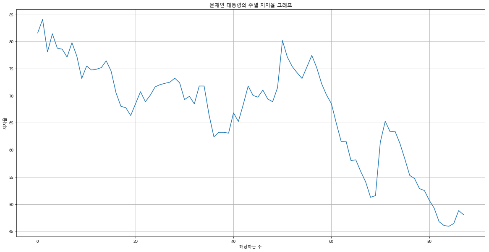

# National-Petition-Approval-Rating-Analysis

문재인 대통령의 지지율과 국민청원간에 상간관계를 분석합니다.


## 지지율

[위키피디아 대한민국의 대통령 지지율](https://ko.wikipedia.org/wiki/%EB%8C%80%ED%95%9C%EB%AF%BC%EA%B5%AD%EC%9D%98_%EB%8C%80%ED%86%B5%EB%A0%B9_%EC%A7%80%EC%A7%80%EC%9C%A8)에서 문재인 대통령의 지지율을 가지고 text를 rating_data에 옮긴 후 **Python**을 이용해서 전처리를 진행한다.

### 주별 지지율 CSV 화

```python
df = pd.DataFrame.from_dict(dic = {"day" : day, "korea_gallop": korea_gallop, "real_meter" : real_meter})
df["approval_rating"] = (df["korea_gallop"].map(find_int) + df["real_meter"].map(find_int))
df["investigation_num"] = (df["korea_gallop"].map(zore_one) + df["real_meter"].map(zore_one))
df["approval_rating"] = df["approval_rating"].map(neatly_data)
df.to_csv("지지율.csv",index=False)
```

### 주별 지지율 그래프화

```python
plt.subplots(1, figsize = (20,7)) # 크기 지정 
plt.plot(dd,test)
plt.grid()
#plt.legend()
plt.xlabel("해당하는 주")
plt.ylabel("지지율")
plt.title("문재인 대통령의 주별 지지율 그래프")
plt.show()
```



```python
mpl.rc('font', family = font_name)

plt.subplots(1, figsize = (20,10)) # 크기 지정 

plt.plot(dd,test, label = "주별 지지율")

plt.scatter(kk,gg, color='r', marker='>', label = "월별 시작")

plt.annotate('국민청원 시작',
             xy=(13,75.2), 
             xytext=(-10, +50), textcoords='offset points', arrowprops = dict(color= 'g', alpha = 0.9))


plt.grid()
plt.legend()
plt.xlabel("해당하는 주")
plt.ylabel("지지율")
plt.title("문재인 대통령의 주별 지지율 그래프")

plt.show()
```


